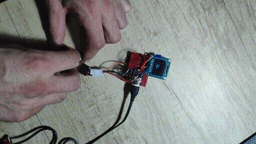
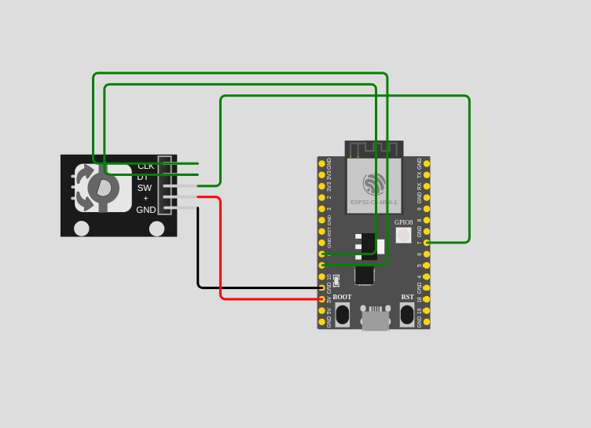

## Learning how to program `esp32c3` with Rust & IDF bindings

Using this little clone with typical a 20 impulses rotary encoder. Esp32C3 does not have a PCNT and I could not make it work with interrupts, so I decided to implement it using hardware timer & basic gray code read from two GPIOs. 

The result & feedback is then transferrd onto an SSD1306 driven 128x64 blue/yellow OLED.

- Generated from https://github.com/esp-rs/esp-idf-template
