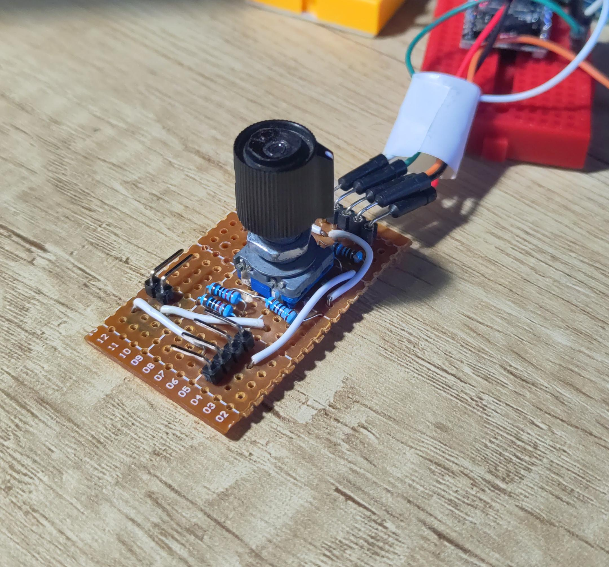

## Learning how to program `esp32c3` with Rust & IDF bindings

Using this little clone with typical a 20 impulses rotary encoder. Esp32C3 does not have a PCNT and I could not make it work with interrupts, so I decided to implement the simplest possible way and it's monitoring the pin levels.

- Generated from https://github.com/esp-rs/esp-idf-template
